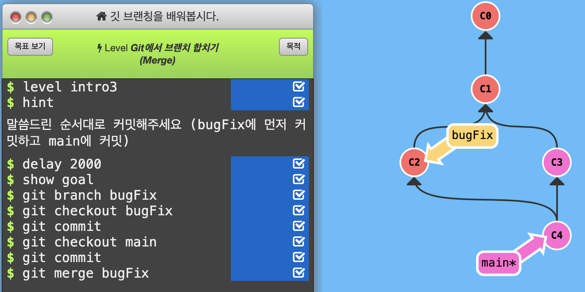
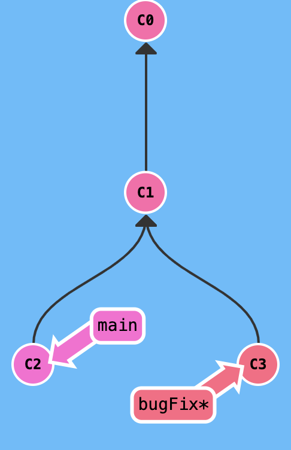
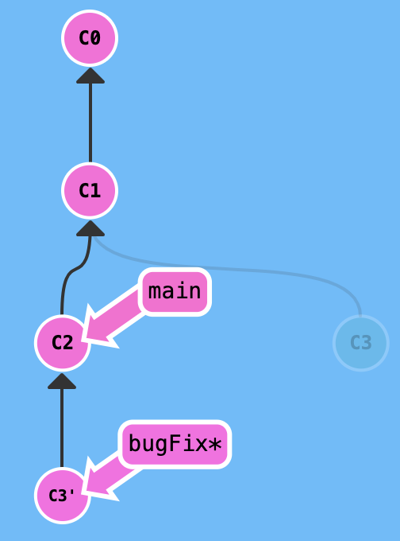
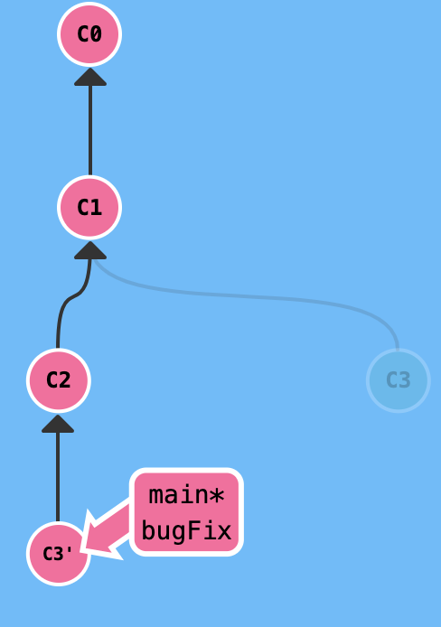
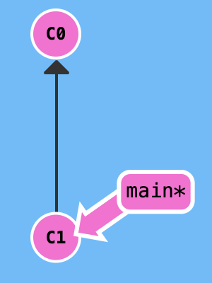
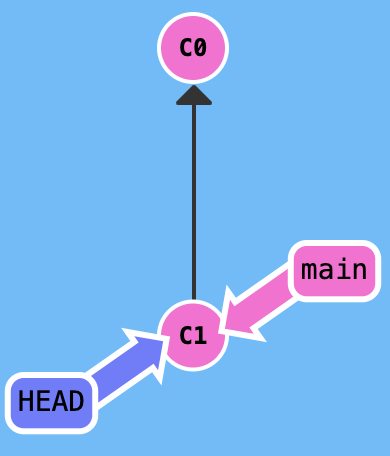
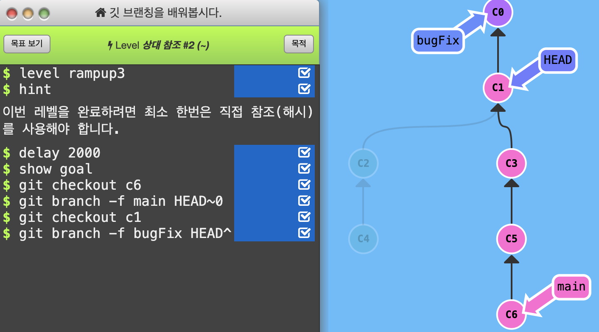
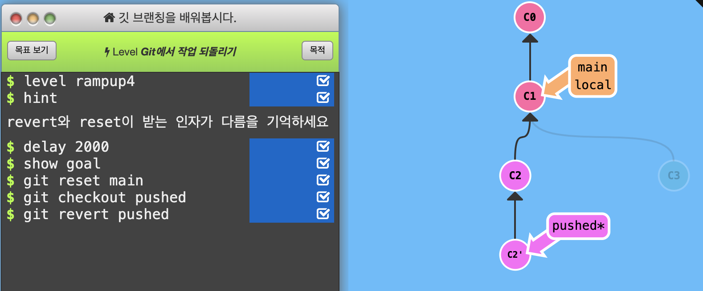

# Git

## git commit

- 자식 커밋 하나 만들기
- git commit

## git 브랜치 (branch)

- 특정 커밋을 가르키는 이름
- 하나의 커밋과 그 부모 커밋을 포함한 작업 내역
- git branch newImage
  - newImage 라는 브랜치를 살펴본다

- git checkout newImage; git commit

## git 합치기 (merge)

- 두개의 브랜치를 만든다

- 두개의 별도의 브랜치를 합친다

- git merge bugFix

- git checkout bugFix; git merge main

## git 합치기 (rebase)

- 커밋들을 모아서 복사한 후 다른 장소에 둔다.

- git rebase main

- git rebase bugFix

## HEAD 분리하기

- HEAD 는 현재 checkout된 커밋 즉, 현재 작업 중인 커밋

- git checkout c1

<figure class="half" >
  
  
</figure>

## 상대 참조

- ^ (서큠플렉스) 한번에 한 커밋 위로 움직인다.
- ~숫자 (틸트 연산자) 한번에 여러 커밋 위로 올라간다. 

## 작업 되돌리기

- git reset
  - 이전 커밋으로 이동한다
- git revert
  - 동명'의 새로운 커밋이 생성되고 변경내용이 기록된다.

- git reset --hard ORIG_HEAD
  - reset 전으로 되돌리기 (바로 이전 작업 한번만 가능하다)

