# git

## Git Remote

## git clone

- 원격 저장소를 로컬에 복제

## remote branch

- 원격 브랜치
- o/ 또는 origin = 원격 저장소의 이름

## git fetch

- 원격 저장소에서 데이터 가져오기

- fetch가 하는 일

```
1.원격 저장소에서 로컬에 없는 커밋들 가져오기
2.원격 브랜치가 가르키는곳 업데이트
```
- fetch가 하지 않는 일
```
1.워킹디렉토리의 상태가 바뀌지 않는다
```

## git pull

- fetch(원격 데이터 가져오기)와 merge(병합)의 기능을 한번에 제공

- git fetch; git merge o/main 는 git pull과 동일한 작업을 한다

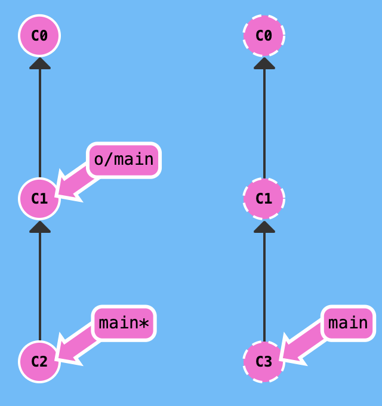
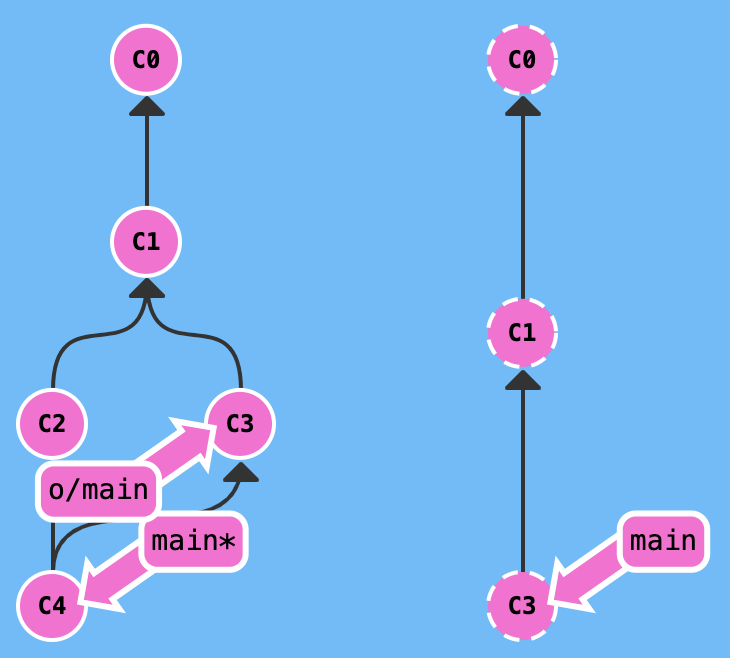

## fakeTeamwork

- 원격 저장소의 변경 사항이 있는 것처럼 가장 할때 사용됨
- git fakeTeamwork 브랜치명 추가할 커밋의 갯수

- git fakeTeamwork foo 3

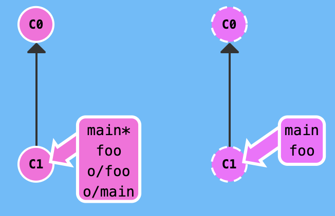
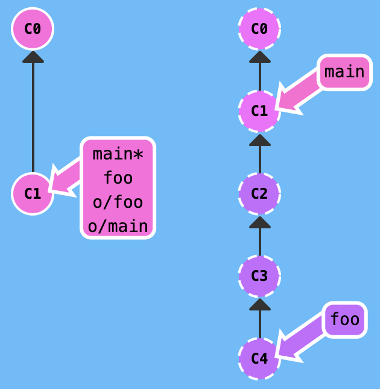

## git push

- git pull와는 반대로 로컬에서 갱싱된 정보를 원격 저장소에 적용시키고 원격 브랜치 또한 갱신한다

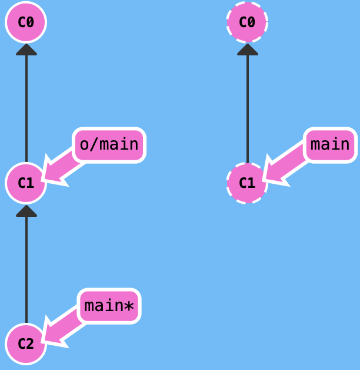
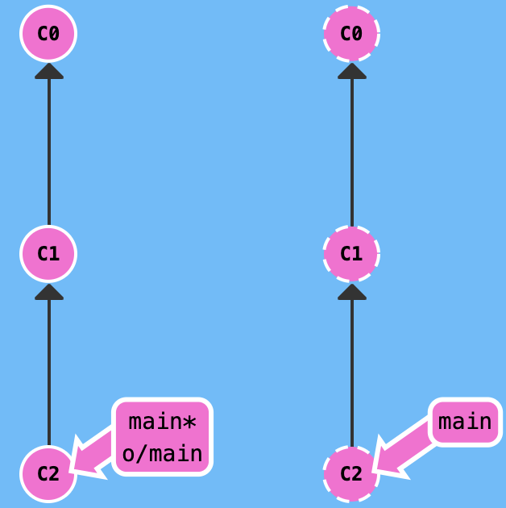

## 엇갈린 히스토리

- git fetch; git rebase 0/main; git push
- git pull --rebase; git push

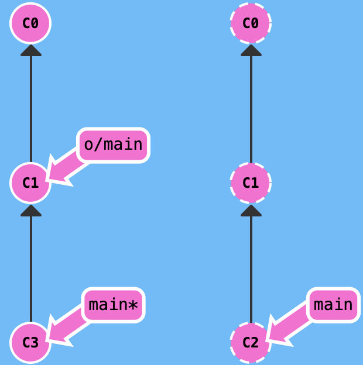
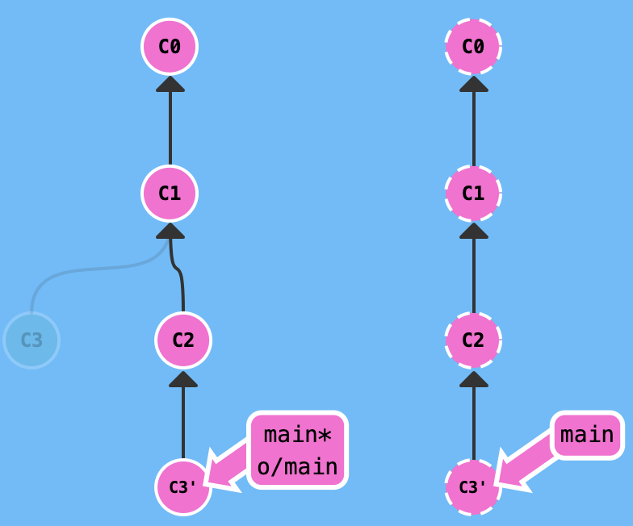

- git fetch; git merge 0/main; git push
- git pull; git push


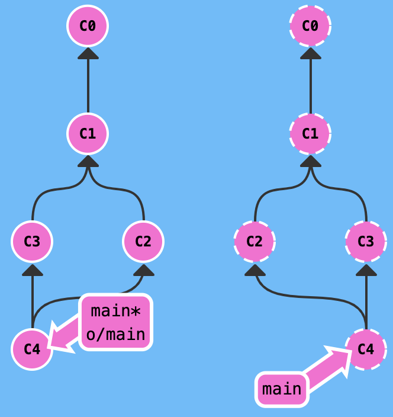

## 원격저장소 거부!

- Remote Rejected!

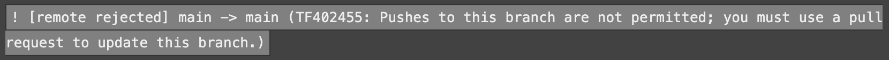

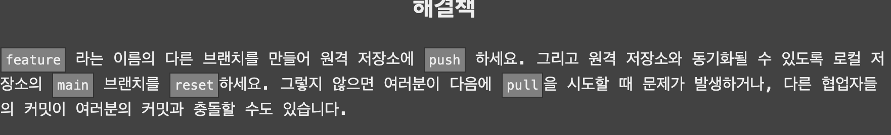
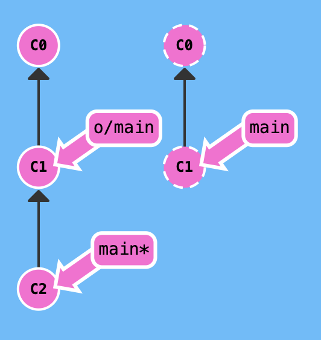
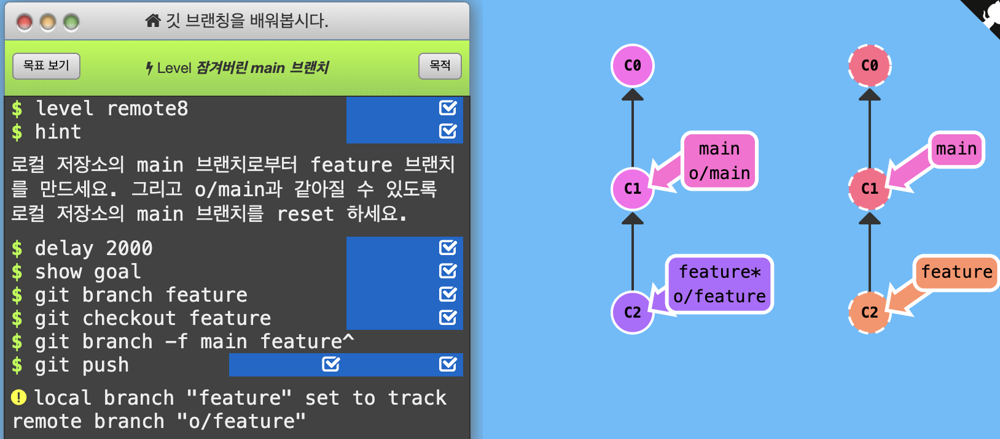
