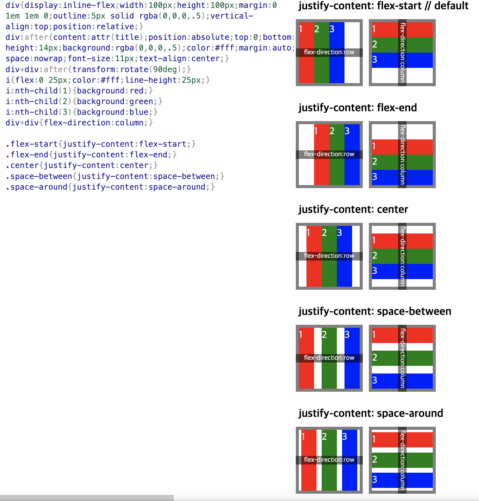

# 2023-12-22
# part1. ch8
# CSS 속성

# 너비(width, height)

- auto(기본값): 브라우저가 너비를 계산
  - 인라인 요소들의 가로 세로 너비를 자동으로 줄이는데 기능
  - 블럭 요소들의 가로 너비를 최대로 늘리고 세로를 줄이는데 기능
- max-width, max-height
  - 요소의 최대 가로/세로 너비
  - none(기본값): 최대 너비 제한 없음
- min-width, min-height
    - 0(기본값):최소 너비 제한 없음

# CSS 단위
- px 픽셀 (염연히 따지면 상대 단위)
- %  어떠한 기준에 대하여 상대적 백분율
- em 요소의 글꼴 크기를 1로 잡고 그의 몇 배수인지
- rem루트 요소(html)의 글꼴 크기 
- vw 뷰포트(페이지 전체의 영역) 가로 너비의 백분율 (최대값=100)
- vh 뷰포트 세로 너비의 백분율
 
# 외부 여백(margin) = 외부로 밀어내기
  - 단축속성
    - 값 하나 지정 = 상하좌우 전부 적용
    - 값 값 = 상하 좌우 적용
    - 값 값 값 = 상 좌우 하 적용
    - 값 값 값 값 = 상 우 하 좌 적용
  - 음수 사용 가능 (겹쳐짐)
  - 기본값 0
  - margin-방향: 해당 방향으로 밀어낸다(top, bottom, right, left)
  - auto: 브라우저가 여백을 계산(가운데 정렬에 활용)
  - 단위: 원하는 단위 사용
    - % 부모 요소의 가로 너비에 대한 비율로 지정

# 내부 여백(padding)
- 외부 여백과 동일 특성
- 내부 여백 많큼 요소의 크기가 증가한다

# 테두리 선(border)과 색상 표현
- 테두리가 들어가면 요소의 크기가 증가한다
- border:두께 종류 색상
- 선두께 (border-width) (단축속성, 개별속성)
  - 중간 두께 (기본) medium
  - 얇은 두께 thin
  - 두꺼운 두께 thick
  - 단위 (권장)
- 선종류 (border-style) (단축속성, 개별속성)
  - 선 없음 (기본) none
  - 실선 (일반 선) solid
  - 파선 dashed
- 선색 (border-color) (단축속성, 개별속성)
  - 기본 검정
  - 색상 지정
  - 투명 transparent
- 색상 표현
  - 색상 이름
  - RGB  (rgb(255,255,255))
  - RGBA (삼원색+투명도0~1)
  - Hex 색상코드 (16진수 색상)(예: #348, #FFFFFF)
- 기타 (개별속성)
  - border-방향:두께 종류 색;
  - border-방향-width:두께;
  - border-방향-style:종류;
  - border-방향-color:색상;

# 모서리 둥글게(border-radius)
- 기본값 0
- 지정된 반지름 값으로 원을 그려 외곽을 깎아낸다
- 값을 여러개 지정해서 원하는 모서리만 깎는 것도 가능하다 (왼쪽 상단에서 시계방향)

# 크기 계산(box-sizing)
- content-box 요소의 내용+padding+border로 크기 계산(기본값)
- border-box 요소의 내용만 적용(padding, border로 커진는 것에 상관없이 사이즈를 정하고 싶을 때)

# 넘침 제어(overflow)
- 자식이 부모보다 클 경우 화면 출력 방식 지정
  - visible (기본값)
  - hidden 넘친 부분 잘라내기
  - scroll 넘친 부분 스크롤로 보여주기 (x,y 축)
  - auto 넘친 부분 스크롤로 보여주기 (넘치는 축만)

# 출력 특성(display)
- 요소의 화면 출력 특성을 변경
  - 값이 지정 되어 있는 요소
    - block
    - inline
    - inline-block
    - 기타
  - 값이 지정되지 않은 요소
    - flex 플렉스 박스 (1차원 레이아웃 수평 혹은 수직 정렬에 용의)
    - grid 그리드 (2차원 레이아웃)
    - none 보여짐 특성 없음, 화면에서 사라짐

# 투명도(opacity)
- 기본값1
- 0~1, 소수점 단위 0 생략 가능

# 글꼴
- font-style 글자의 기울기 지정
  - normal 기울기 없음 (기본값)
  - italic 기울어진 글자
- font-weight
  - normal 400
  - bold 700
  - 100~900
- font-size
  - 16px (기본크기)
  - 단위 (px, em, rem)
- line-height
  - 한 줄의 높이
  - normal (기본값-브라우저 초기화 할 때 사라짐)
  - 숫자 요소의 글꼴 크기의 배수로 지정
  - 단위
- font-family
  - 사용할 글꼴 후보를 지정
  - font-family:글꼴1, "글꼴2", ... 글꼴계열; (글꼴계열은 필수))

# 문자
- color 기본값 rgb(0.0.0) 검정색
- text-align 문자 수평정렬, 기본값 left
  - 오른쪽 정렬 right
  - 가운데 정렬 center
  - 양쪽 정렬 justify
- text-decoration 문자에 장식 선 기본값 none
  - 밑줄 underline
  - 윗줄 overline
  - 중앙선 line-through
- text-indent 들여쓰기
  - 기본값 0
  - 단위 (음수 사용으로 내어 쓰기 가능)
- 예외: a태그는 기본색이 파랑 혹은 보라색, 밑줄 들어감

# 배경
- background-color 기본값 투명함 transparent
- background-image 기본값 none
  - background-image: url("")
- background-repeat 기본값 이미지 반복 출력 repeat
  - no-repeat 반복 없음
  - repeat-x 이미지를 수평 반복
  - repeat-y 이미지를 수직 반복
- background-position 요소의 배경 이미지 위치 기본값 0%0%(왼쪽 상단)
  - 4방향+중앙
  - 단위
- background-size 이미지 크기 조작 기본값 auto 이미지 실제 크기
  - 단위
  - cover 상하, 좌우 중 더 넓은 쪽에 맞춤
  - contain 상하, 좌우 중 더 짧은 쪽에 맞춤
- background-attaachment
  - scroll 기본값 이미지가 요소를 따라서 같이 스크롤
  - fixed 이미지가 뷰포트에 고정, 스크롤 

# 배치
- position 요소의 위치 지정 기준 (음수 사용 가능)
  - static 기본값 기준없음
  - relative 요소 자신을 기준
  - absolute 위치 상 부모 요소를 기준
  - fixed 뷰포트를 기준
- 요소 쌓임 조건
  - `1`기본값을 제외하고 포지션 값이 있는 경우
  - `2`z-index의 값이 크면 위에 쌓인다
  - `3`더 나중에 작성된 것
  - 조건 1,2,3 순으로 우선 순위
  - z-index 요소의 쌓임 정도를 지정
    - auto 기본값(0)
    - 숫자 높을 수록 위에 쌓임 (음수 사용가능)
  - position의 값으로 absolute, fixed이 지정된 요소는, display 속성이 block으로 변경된다.

## justify-content

# 플렉스

  - display
    - flex 요소 수평정렬, 컨테이너 수직정렬
    - inline-flex 요소 수직정렬, 컨테이너 수직정렬
  - flex-direction 주 축을 설정
    - row 좌-> 우
    - row-reverse 우-> 좌
    - column 위->아래
    - column-reverse 아래-> 위
  - flex-wrap: flex items 줄 바꿈 여부
    - nowrap 기본값 줄바꿈 없음
    - wrap
  - justify-content 주축 정렬 시작점
    - flex-start
    - flex-end
    - center
  - align-content 교차축 묶음 정렬 시작점
    - stretch 기본값 Flex items를 시작점으로 정렬
    - flex-start Flex items를 시작점으로 정렬
    - flex-end Flex items를 끝으로 정렬
    - center Flex items를 가운데 정렬
  - align-items 교차축 한 줄 정렬
    - stretch 기본값 Flex items를 교차 축으로 늘림
    - flex-start Flex items를 시작점으로 정렬
    - flex-end Flex items를 끝으로 정렬
    - center Flex items를 가운데 정렬
  - order flex item의 정렬 순서
    - 기본값 0, 음수 가능, 숫자가 작을수록 우선 순위
  - flex-grow flex item의 증가 너비 비율
    - 화면의 공간을 어떻게 나눠가질 비율
    - 기본값 0
  - flex-shrink flex item의 감소 너비 비율 
    - 화면의 크기를 축소할 때 해당 요소의 크기가 같이 작아지게 할 것인지
    - 기본값 1
  - flex-basis flex item의 공간 배분 전 기본 너비
    - auto 기본값, 요소의 content 너비
    - 단위

