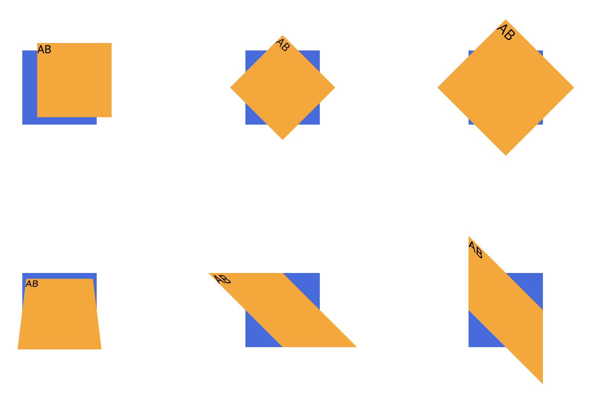
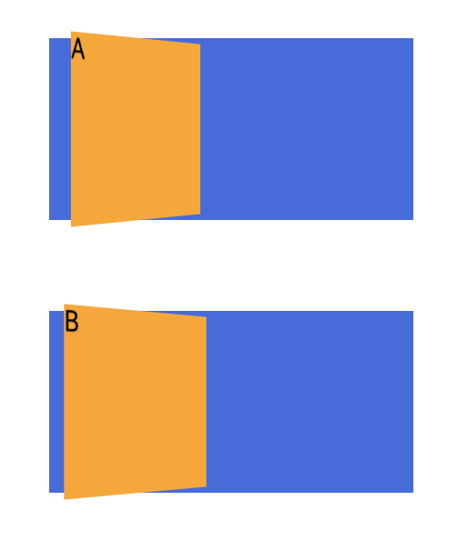

# 변환 

## transform
### 2D 변환 함수

- 단위 없음
``` 
- translate(x,y) 이동 x,y 축
- translateX(x) 이동 x 축
- translateY(y) 이동 y 축
- scale(x,y) 크기 x,y 축
```

- deg 단위
```
- rotate(deg) 회전 각도
- skewX(x) 기울임(x축)
- skewY(y) 기울임(y축)
```
### 3D 변환 함수

- 단위 px
```
- perspective(n) 원근법(거리)
  (다른 transforn 보다 우선해서 작성, 크기가 작을수록 원근감 상승)
```
- deg 단위
```
- rotateX(x) x 축 회전
- rotateY(y) y 축 회전
- rotateZ(z) z 축 회전
```

## perspective 함수와 속성의 차이점
```
          함수             속성
적용 대상   관찰 대상         관찰대상의 부모
기준점     회전할 대상의 중심   회전 대상의 부모의 중심
```

## backface-visibility
```
- 기본값 visibe 뒤집어도 뒷면이 보임
- hidden 뒷면을 숨김
```
