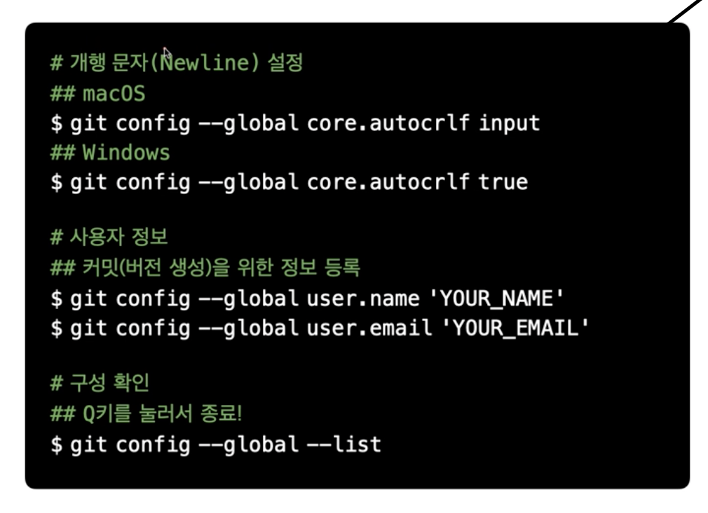
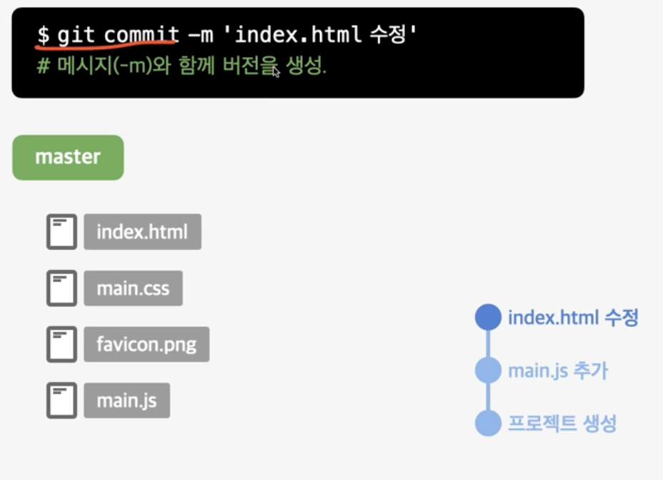
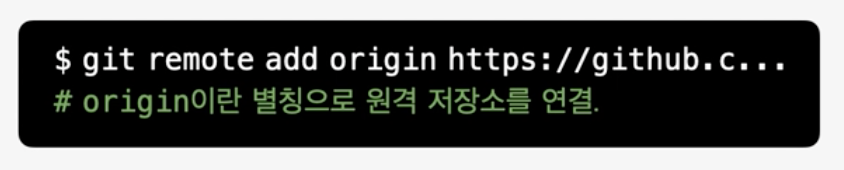

# GitHub 업로드

## Git 사용자 로컬 설치

- 개행 문자 설정
  - 운영체제마다 다른 환경을 감안하여 문제가 없이 사용 가능하도록 처리

- 사용자 정보
  - 유저의 이름과 이메일은 github에 등록한 정보와 동일하게 하는것이 좋다.

## 버전 관리

- 버전 관리를 시작하는데 어떤 파일을 기준으로 할것인지 명시 해야함.

- 특정 파일 지정

- 전체 파일 지정

- 이름을 정하고 버전을 생성

- 변경 사항이 있을시 다시 추적

- 내용이 변경 되었을 때 이전 버전과 현재 버전을 별개로 저장

## 원격 저장 (GitHub)

- 로컬의 환경에서만 저장 되어있기 떄문에 사용자의 컴퓨터에 이상이 발생하면 저장해둔 버전들이 사라진다.
  - 해결 방법 = 원격 저장 (예:GitHub)

- GitHub에 원격 저장소 생성

- 별칭은 다른 이름으로 변경해서 사용해도 된다.

- 연결된 통로를 통해서 전송
- 로그인 절차를 통해서 인증