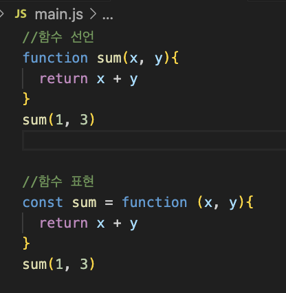
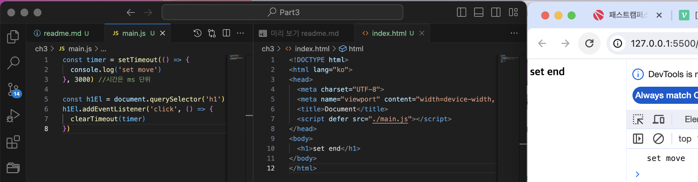
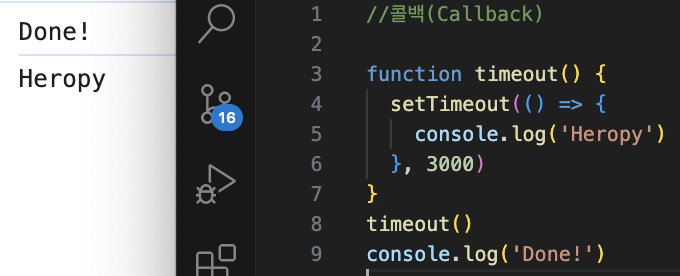
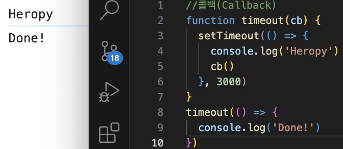

# js 함수

함수를 반복적으로 사용할 경우 변수에 함수 실행의 내용을 저장해서 재활용한다.

```
함수의 이름이 없으면 익명함수
함수의 이름이 있으면 기명함수
함수선언방식 function 키워드와 함수의 이름을 작성
함수표현방식 익명함수를 변수에 담아서 사용
```


## arguments 객체
```
지역변수, 함수 내에서 모든 인수 참조 가능, 항목의 인덱스는 0부터 시작, 직관적이지 않아 권장되지 않음
```

## 화살표 함수 =>
```
일부 내용을 생략해서 축약형으로 용량 최소화
축약형으로 객체 데이터를 반환하기 위해서는 중괄호를 소괄호로 감싸서 만들면 된다.
```
```
화살표 함수 변환 예제

const double = function (x) {
  return x * 2
}
console.log('double:',double(7))

=>
const double = x => x * 2
console.log('double', double(7))
```

## 즉시실행함수 (IIFE)

```
Immediately Invoked Function Expression

함수가 즉시 실행 될것이고 그 이후 다시 필요 되지 않는 경우 사용된다

익명 함수를 작성한 뒤 소괄호로 감싸주고 끝에 소괄호를 하나 붙인다
```

```
IIFE 예제

const a = 7
function bouble() {
  console.log(a * 2)
}
double();

IIFE
(function bouble(){
  console.log(a * 2)
})();
또는
(function bouble(){
  console.log(a * 2)
}());
```

## 호이스팅 (hoisting)

`함수 선언`부가 유효범위 최산단으로 끌어올려지는 현상

```
함수 표현 방식에서는 하단에 작성한 함수는 위에서 호출하는 함수에 영향을 주지 못한다.  
하지만 함수 선언 방식으로 작성하는 경우에는 호이스팅이 발생하여 위에서 호출하는 함수에도 영향을 끼친다.
```
```
호이스팅 사용 예제
const a = 7
double()
const double = function (){
  console.log(a * 2)
}
결과는 error

호이스팅
const a = 7
double()
function double(){
  console.log(a * 2)
}
결과는 14
```

## 타이머 함수

1. setTimeout(함수, 시간):일정 시간이 경과한 후 함수 실행
   - clearTimout():설정된 Timeout 함수를 종료
1. setInterval(함수, 시간):시간 간격마다 함수 실행
   - clearInterval():설정된 Interval 함수를 종료



setInterval은 위의 코딩에서 Timeout을 Interval로 바꾸면 된다.

## 콜백

함수의 인수로 사용된 함수  
다른 함수가 실행을 끝낸 뒤 실행되는 함수  
코드 간결성을 위해 익명 함수 사용

 | 
---|---|