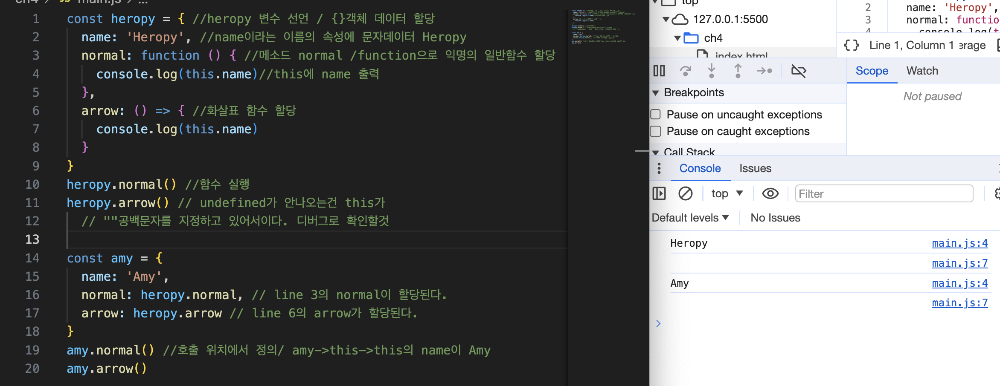
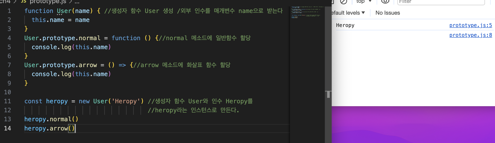
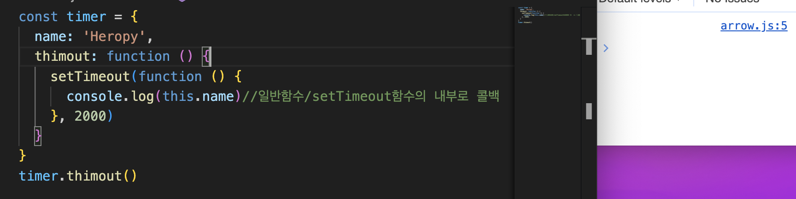
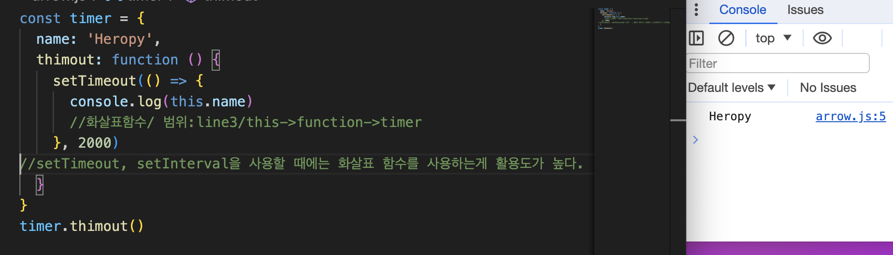

# JS 클래스

속성(property)  
메소드:속성+함수데이터  
멤버:속성과 메소드를 통합해서 지칭

## 클래스와 사용자 함수

### 클래스

클래스의 정의

```
객체 생성 메커니즘이다.
클래스는 함수이다.
클래스와 생성자 함수 모두 프로토타입 기반의 인스턴스를 생성한다. (동일하게 동작하지는 않음)
클래스는 생성자 함수보다 엄격하다.
생성자 함수에서는 제공하지 않는 기능이 제공된다.
'new' 연산자 없이 호출 하면 에러가 발생한다.
상속을 지원하는 'extends', 'super'키워드를 제공한다.
호이스팅이 발생하지 않는 것처럼 동작한다.
모든 코드에는 암묵적으로 strict mode가 실행되며 해제 불가능하다.
```

### 생성자 함수 (prototype)

생성자 함수 정의

```
JS는 prototype 기반의 프로그래밍 언어이다.
객체(인스턴스)를 생성하는 함수이다.
일반 함수와 동일한 방법으로 생성자 함수를 정의한다.
'new'를 앞에 붙여서 호출해야만 한다.
생선자 함수 내부에 return문은 "반드시" 생략한다.
상속을 지원하는 'extends', 'super'키워드를 제공하지 않는다.
호이스팅이 발생한다.
모든 코드에는 암묵적으로 strict mode가 지정되지 않는다.
```
 
 ### 둘의 공통점

프로토타입 기반의 객체지향을 구현한다.  
인스턴스를 생성 할 수 있는 함수이다.  
암묵적으로 첫 문자는 대문자로 작성한다.

## this

일반함수에서는 `호출 위치`에 따라서 this가 정의된다. ?  
화살표 함수에서는 `자신의 선언된 함수 범위`에서 this가 정의된다.




setTimeout을 사용할 경우


