# JS 데이터

## 문자 데이터

### string mdn에서 확인하기  


String.Prototype.indexOf()

- 문자열에서 주어진 문자가 처음 나오는게 몇번째인지 보여준다.  
해당하는 문자가 없으면 -1을 반환한다

length

- 문자열의 크기를 나타낸다.

slice

- 문자열에서 첫번째 인수와 두번째 인수 바로 앞을 잘라서 나타낸다.

replace (치환)

- 첫번째 인수를 지우고 두번째 인수로 대체한다.

trim

- 앞뒤 공백 제거

match

- 문자 데이터에서 정규표현식을 사용하여 특정한 문자를 일치 시키고 배열 데이터로 반환하여 아이템으로 추출하여 사용 

**실행 결과**

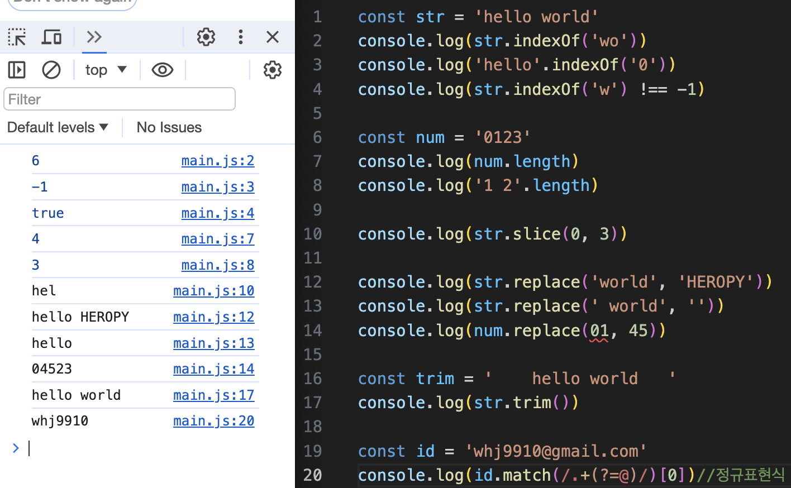

### 정규표현식 (regex)


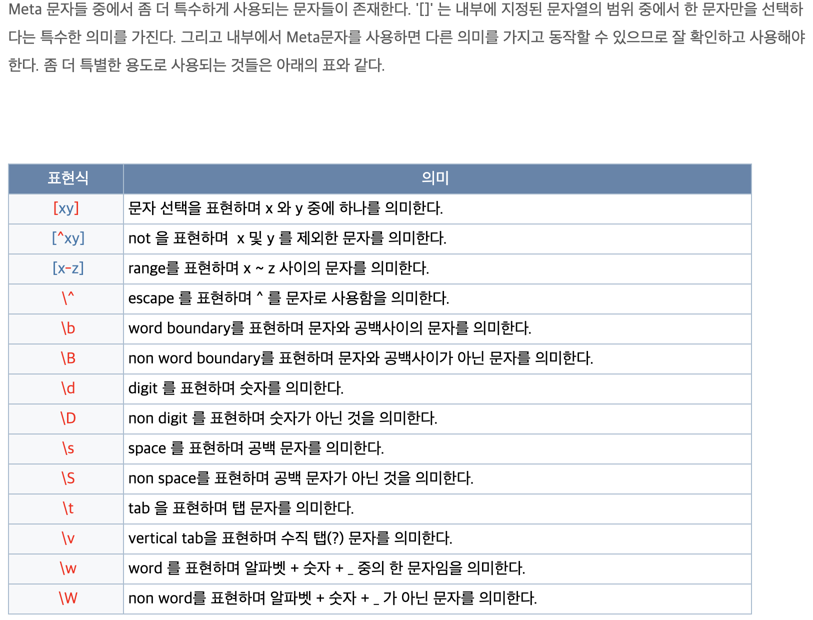
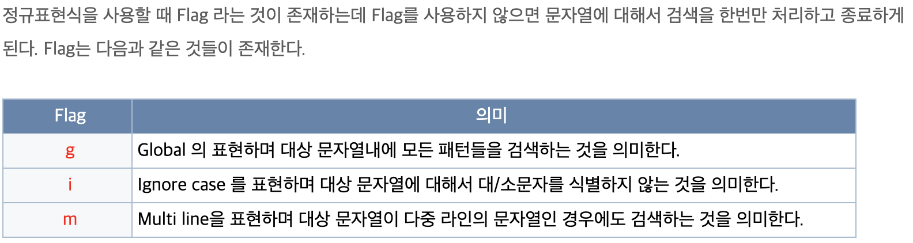

## 숫자 데이터

### toFixed 메소드

toFixed(n) - 소수점 n번까지 잘라서 문자 데이터로 반환한다.  
toFixed를 사용 하면 문자 데이터로 반환되는 이유?
- js에서 0.1과 제곱들은 정확히 표현되지 않는다.
- 정확히 표현하기 위한 유일한 수단이 문자 타입이다.

### parseInt, parseFloat 변수

js 전역함수이다  

parseInt(문자 데이터) - 분석한다/정수를 문자 데이터에서 정수를 찾아서 숫자 데이터로 반환한다.
parseFloat(문자 데이터) - 분석한다/숫자를 문자 데이터에서 숫자를 찾아서 숫자 데이터로 반환한다.

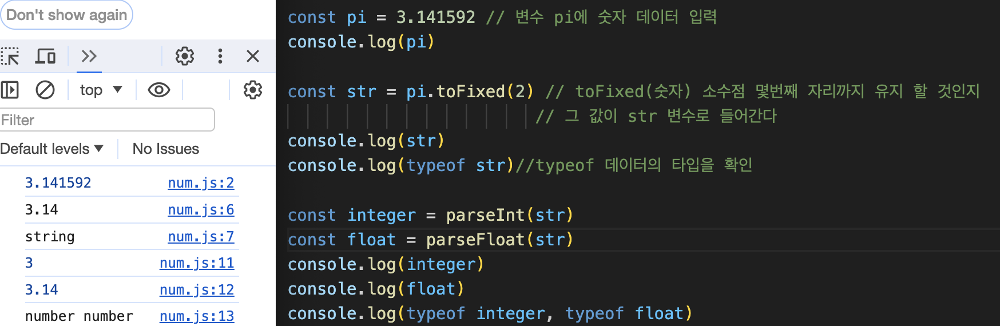

## Math 함수

속성과 메서드를 가진 내장 객체  

abs() - 함수에 주어진 숫자의 절대값을 반환합니다. 

min( , ) - 들어온 데이터 중 작은 값을 반환합니다.

max( , ) - 들어온 데이터 중 가장 큰 값을 반환합니다.

ceil() - 정수단위에서 올림값을 반환합니다.

floor() - 정수단위에서 내림값을 반환합니다.

round() - 정수단위에서 반올림값을 반환합니다.

random() - 1이 되지 않는 랜덤한 값을 반환한다.

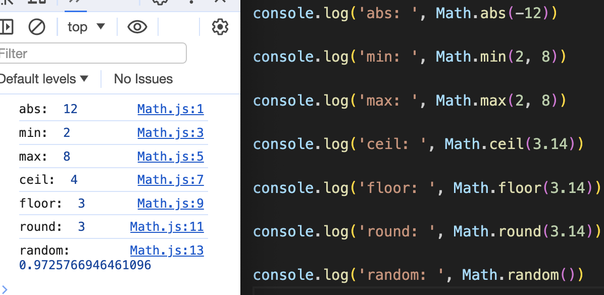

## 배열(array) API

대괄호로 묶여져있는 item(element, 요소)들의 집합이다.  
배열은 zero based이다.  
배열된 요소들의 순번을 index라고 부른다.  
인덱스에 접근하는 행위를 indexing이라고 부른다.

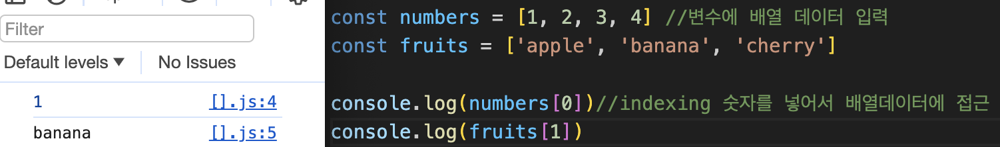

### length

배열의 길이 즉, 배열에 들어간 요소의 개수를 확인

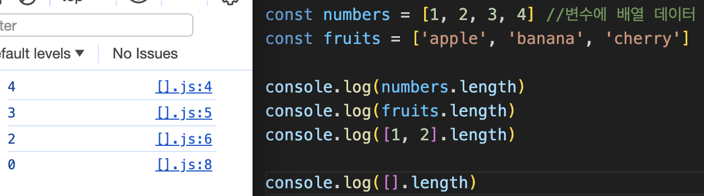

### concat

두개의 배열 연결해서 새로운 배열을 만든다. 원본은 손상되지 않는다.

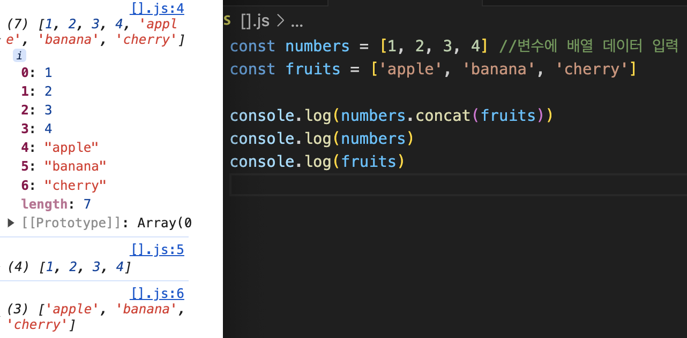

### forEach

앞에 붙은 변수의 배열 데이터의 아이템 수 많큼 인수로 사용된 콜백이 반복 실행  
for문을 대체하는 메소드이다  
callback의 값을 반환하지 않는다  

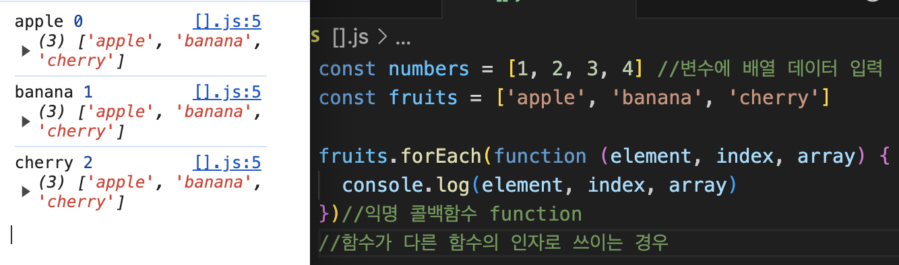
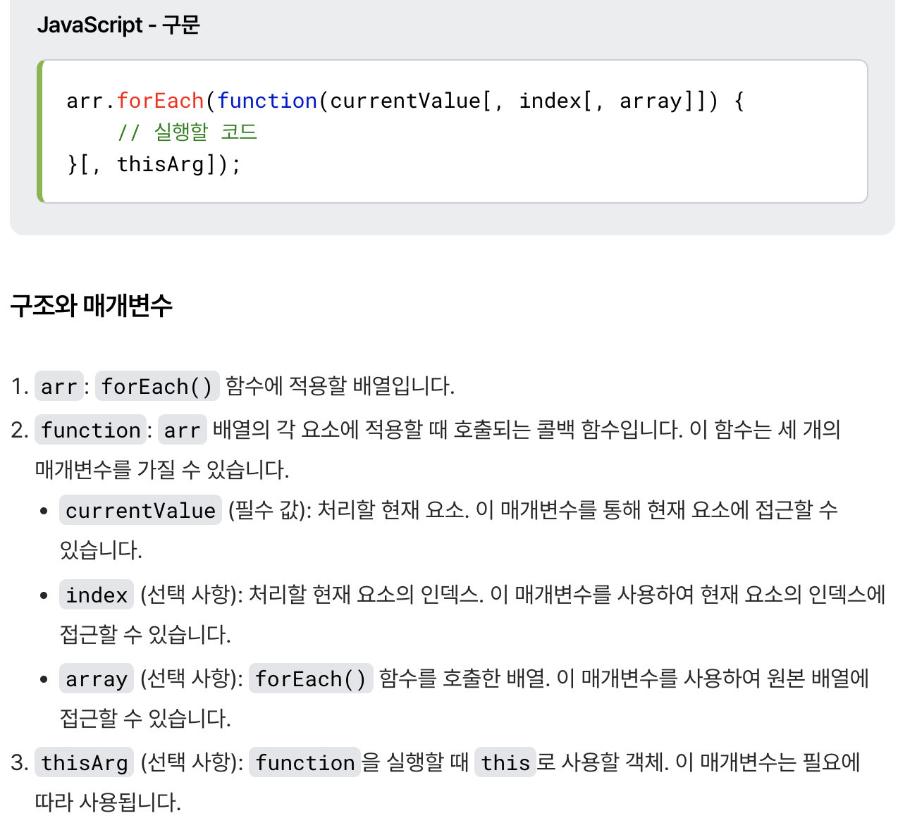


### map

forEach와 동일하되, callback 내부에서 return을 통해서 반환한 데이터를 새로운 배열로 만들어서 사용 할 수 있다.

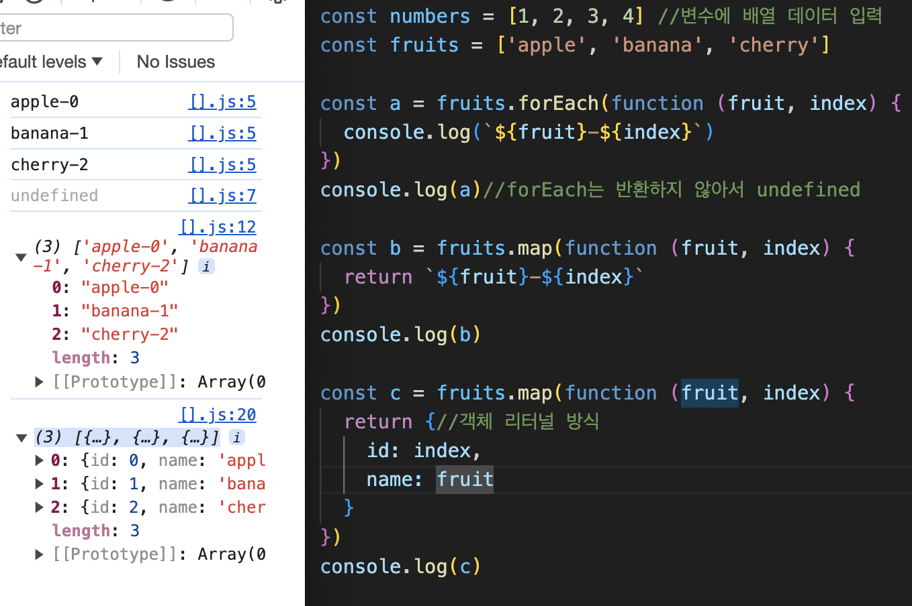

- 객체 리터럴 방식 - 여러가지 변수를 하나의 묶음으로 나타낼 때 객체를 사용하는데 이런 객체를 표현할때 {}를 사용한다.

### filter

조건을 만족하는(true) 경우만 아이템의 상태 그대로 반환하여 새로운 배열을 만든다.  


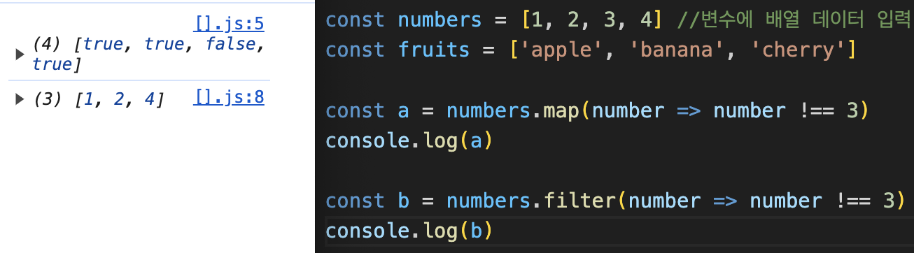

### find, findIndex

find - 콜백에서 찾고있는 무언가를 찾으면 반복을 멈추고 찾은 아이템을 반환한다.

findIndex - 찾은 아이템의 인덱스 번호를 반환한다.

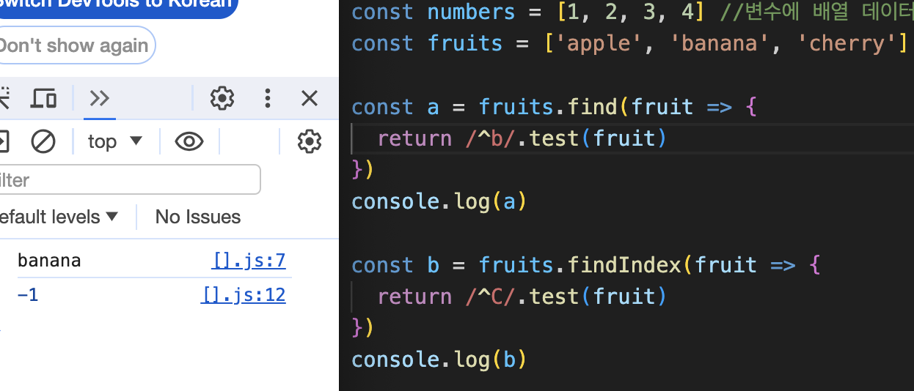

- findIndex가 -1이 나온 것은 IndexOf와 동일하게 없는 값을 찾았기 때문이다.
- 인덱스를 결과로 돌려주는 함수에서 결과가 없는 경우 대부분 -1을 반환한다.
indexOf, lastIndexOf, findIndex


### includes()

배열 데이터 부분에 includes의 인수로 사용된 데이터가 포함되어있는지 확인해주는 메소드

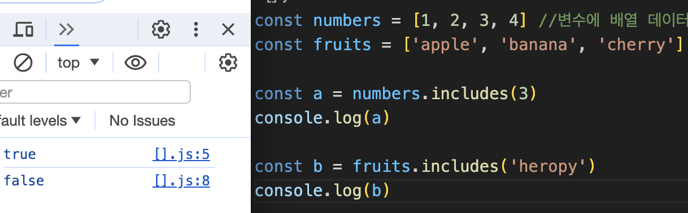

### push(), unshift()

<u>_원본수정됨 주의_</u>

- push - 배열 데이터 가장 뒤에 아이템을 삽입
- unshift - 배열 데이터 가장 앞에 아이템을 삽입

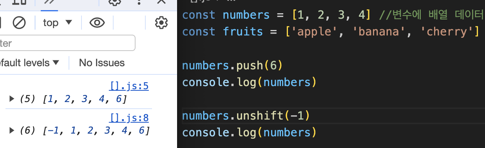

### revers()

<u>_원본수정됨 주의_</u>  

배열 데이터의 순번을 뒤집는다.

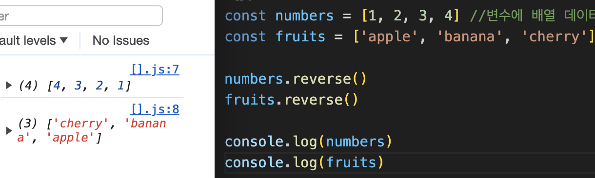

### splice(n,m,z)

<u>_원본수정됨 주의_</u>

인덱스 번호 n번에서 시작해서 m개 지워라  
z를 그 자리에 끼워 넣어라

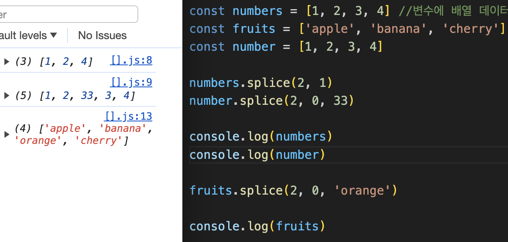

## 객체

### assign

assign(인수1 대상객체, 인수2 출처객체)  
출처객체의 정보를 대상객체에 집어넣는다.  
target 변수에 반환  
객체 데이터 통합 또는 객체 데이터 복사에 사용

`일치연산(===) 두개의 객체가 참조한 메모리 주소가 동일하면 True` 참조형 데이터의 특징 (예:{},[],function)  
불변성 강의 참조

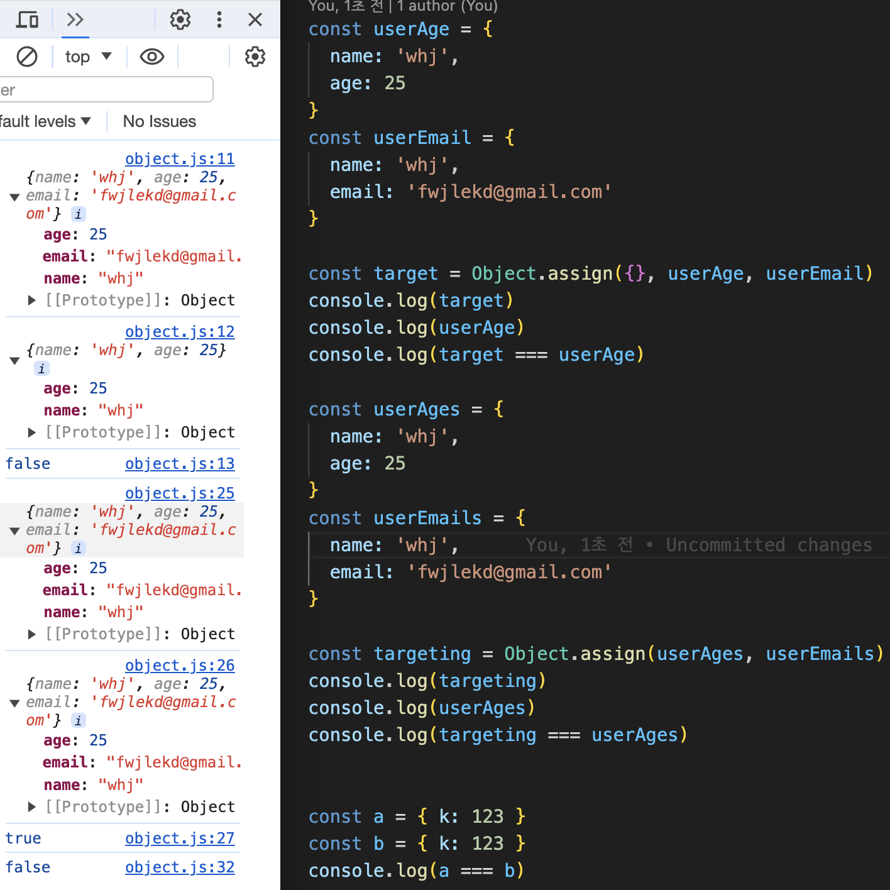


### keys

```js
const user = {
  name: 'whj',//키:벨류 형태 = 프로퍼티: 특정값
  age: 25,
  email: 'ewfsdfweadfawefavva'
}

const keys = Object.keys(user)//프로퍼티 값을 가져와서 새로운 배열(keys) 데이터를 만든다
console.log(keys)// ['name', 'age', 'email']

console.log(user['email'])//인덱싱 ['프로퍼티 이름'] 키의 이름을 넣으면 벨류값이 나온다
                          // ewfsdfweadfawefavva

const values = keys.map(mb => user[key]) //keys값이 매개변수 mb로 들어가고 별류값이 나온다
console.log(values)// ['whj', 25, 'ewfsdfweadfawefavva']
```

## 구조 분해 할당 (비구조화 할당)

객체 데이터에서 내용을 분해해서 원하는 속성만 꺼내 사용하는것

```js
const user = { // 변수에 객체 데이터 할당
  name: 'whj',
  age: 25,
  email: 'ewfsdfweadfawefavva'
}

const { name: whj, age = '30', email, address = 'usa' } = user//구조 분해/const 또는 let 사용

console.log(`사용자의 이름은 ${whj}입니다.`) // 호출명 name을 whj로 변경
console.log(`${whj}의 나이는 ${age}세입니다.`)//age의 기본값을 할당연산자로 30 으로 설정, 하지만 실제 데이터 25가 출력
console.log(`${whj}의 이메일 주소는 ${email}입니다`)
console.log(address)//주소의 기본값으로 usa를 추가

const fruits = ['apple', 'banana', 'cherry']
const [a, b, c, d] = fruits //순서대로 할당
console.log(a, b, c, d)
```
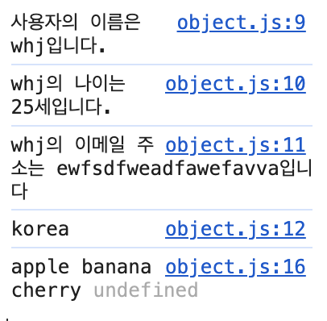

## 전개 연산자 (spresd)

배열 또는 객체 데이터를 나열해주는 연산자
배열 또는 객체 데이터의 변수 앞에 ... 을 붙인다.

```js
const fruits = ['apple', 'banana', 'cherry', 'orange']
console.log(fruits)
console.log(...fruits)

function toObject(a, b, ...c) { //...c를 rest parameter(나머지 매개변수)라고 부른다.
  return {
    1: a,
    b: b, //속성명 변수명이 동일하면 하나만 남겨도 된다. b,
    3: c
  }
}
console.log(toObject(...fruits)) // 두줄의 결과는 동일하다.
console.log(toObject(fruits[0], fruits[1], fruits[2]))
```
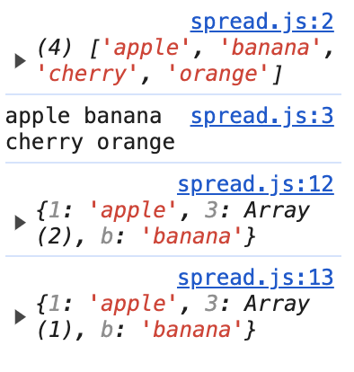

## 데이터 불변성 (Immutability)

원시 데이터 = 기본 데이터 (string, number, boolean, undefined, null)  
생긴것이 다르면 다른 데이터, 같으면 값은 데이터 = 데이터 불변성  

```js
let a = 1
let b = 4
console.log(a, b, a === b) 
b = a
console.log(a, b, a === b)
a = 7
console.log(a, b, a === b)
let c = 1 //c에 할당된 1이 기존 메모리에 있는 데이터 1을 바라본다.
console.log(b, c, b === c) // 데이터의 불변성 (기존의 데이터는 변하지 않는다.)
```
|1: 1   |2: 4   |: 7   |:


참조형 데이터 = object {}, array[], function 콜백  
생긴것이 같아도 다른 데이터일 수 있다. 불변성이 없다.

```js
let d = { k: 1 } // 1번 메모리 1
let e = { k: 1 } // 2번 메모리 1
console.log( d, e, d === e) //d와 e가 바라보고있는 메모리 주소가 달라서 false
d.k = 7 // 1번 메모리 7
e = d // e도 d가 참조하고 있는 1번 메모리 주소를 참조한다.
console.log(d, e, d === e)
d.k = 2 // 1번 메모리 2
console.log(d, e, d === e) // 한쪽 변수 값을 수정하면 같이 참조하고있는 다른 변수도 값이 변한다.
let f = e 
console.log(d, e,f, d === f)
a.k = 9
console.log(d, e, f, d === f)
```

## 복사

각 변수를 별개로 구분해서 관리하고자 한다면 복사를 사용해야 한다.  
각 변수를 실제 메모리 상에서 분리한다.

### 얕은 복사

객체의 참조값(주소값)을 복사
```js
const user = {// 참조형 데이터  
  name: 'heropy',
  age: 85,
  emails: ['qwertyuiop']
}
// const copyUser = user // user와 copyUser의 참조 위치가 동일
// console.log(copyUser === user)

const copyUser = Object.assign({}, user) // ({대상객체}, 출처객체) 대상객체에 출러객체의 값을 담아서 copyUser에 반환한다
// const copyUser = {...user} //윗줄과 동일한 얕은 복사
console.log(copyUser === user)

user.age = 22
console.log('user', user)
console.log('copyUser', copyUser)
```
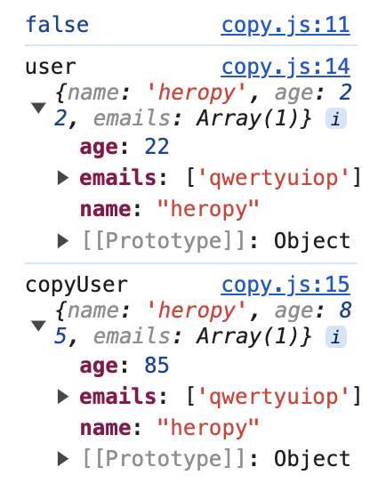

### 깊은 복사

객체의 실제값을 복사  
복사에 의한 값의 변경의 방지

```js
import _ from 'lodash'

const user = {
  name: 'heropy',
  age: 85,
  emails: ['qwertyuiop']
}
const copyUser = _.cloneDeep(user) //깊은 복사
console.log(copyUser === user)

user.age = 22
console.log('user', user)
console.log('copyUser', copyUser)

user.emails.push('asdfghjkl')
console.log(user.emails === copyUser.emails)
console.log('user', user)
console.log('copyUser', copyUser)
```