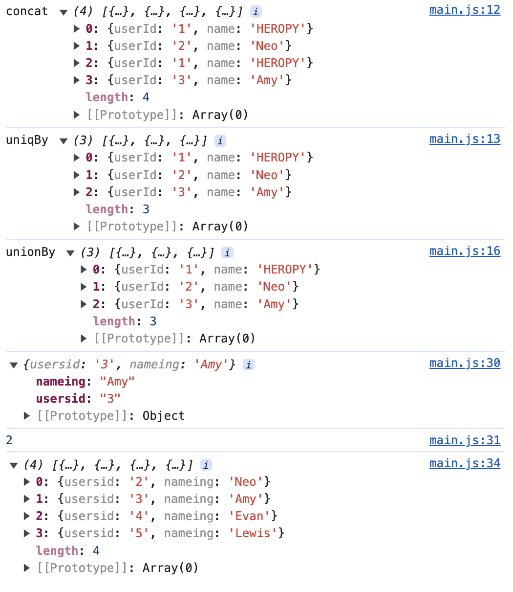
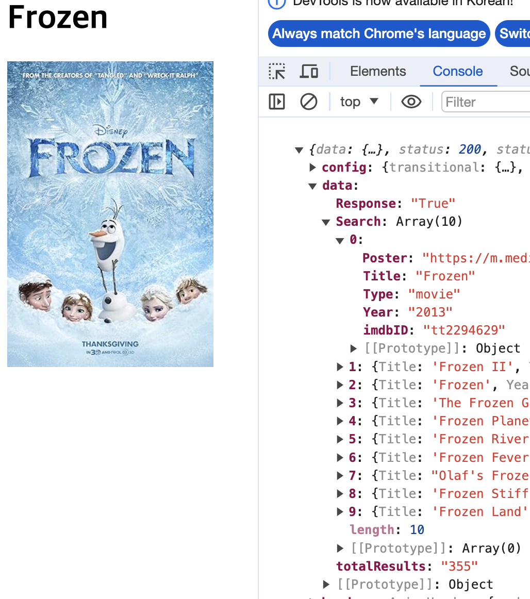

# js 데이터 실습

## import, export

import
- 외부에 있는 js 파일을 가져오는 통로
- default를 통해 가져오는 경우 {}없음
- {}가 사용된 경우 이름을 지정해야되는 통로
- as 를 사용하여 활용할 이름을 변경 할 수 있다.
- 한번에 꺼내기 
```js
import * as 원하는 이름 from 
```

export
- default export
  ```js
  export default function getType(data) // getType 삭제 가능
  ```
  - 이름 지정 안해도 되는 기본 통로
  - 이름이 지정 되지 않았으면 불러올 때도 이름을 원하는데로 바꿀수 있다.
  - defaurt는 하나의 모듈에서 하나만 사용 가능하다.

- named export
  ```js
  export function getType(data)
  ```
  - 이름 지정 필수
  - 개수의 제한이 없다.

## Lodash

lodash는 js의 라이블러리 중 하나로 데이터의 구조를 함수형으로 다룰 수 있게 하기 위해 만들어졌다.  
_기호를 선언하여 사용된다.  

lodash의 설치
- 먼저 만들어둔 package.json에 추가 하기위해 터미널에서 npm install lodash를 입력한다.
```js
import _ from 'lodash'

const usersA = [
  { userId: '1', name: 'HEROPY' },
  { userId: '2', name: 'Neo' }
]
const usersB = [
  { userId: '1', name: 'HEROPY' },
  { userId: '3', name: 'Amy' }
]
const usersC = usersA.concat(usersB)//합치기
console.log('concat', usersC)
console.log('uniqBy', _.uniqBy(usersC, 'userId'))//중복 제거

const usersD = _.unionBy(usersA, usersB, 'userId')//중복없이 합치기
console.log('unionBy', usersD)
```
```js
import _ from 'lodash'

const users = [
  { usersid: '1', nameing: 'Heropy' },
  { usersid: '2', nameing: 'Neo' },
  { usersid: '3', nameing: 'Amy' },
  { usersid: '4', nameing: 'Evan' },
  { usersid: '5', nameing: 'Lewis' }
]

const foundUser = _.find(users, { nameing: 'Amy'})//이름이 Amy인 객체가 출력 된다
const foundUserIndex = _.findIndex(users, {nameing: 'Amy'})//찾은 객체의 인덱스 번호를 출력한다
console.log(foundUser)
console.log(foundUserIndex)

_.remove(users, { nameing: 'Heropy'})//객체 제거
console.log(users)
```



## JSON (Java Script Object Notation)

[JSON이란?](https://ko.wikipedia.org/wiki/JSON)

하나의 문자 데이터이다.  
키 : 값의 쌍으로 이루어진 구조  
구성요소 관리가 편리하다.  
import로 가져와져서 객체 데이터처럼 사용된다.  
nudefined 사용 불가하다.  
컴퓨터 프로그램의 변수값을 표현하는데 유용하다.  
js에서 전역 객체로 사용 할 수 있다.  

JSON.parse: js 형태로 변경
stringify: js 내부에서 특정 데이터를 json의 포맷으로 문자 데이터화 시켜주는 메소드

## storage

키와 값은 문자열이여야 한다.  
파기되지 않는다.  
오리진(도메인, 프로토콜)에 묶여있습니다.

### localStorage

브라우저의 key-value 값을 Storage에 저장 할 수 있다.
웹페이지의 세션이 끝날때 저장된 데이터가 지워지지 않는다.  
오리진의 같을 경우 데이터는 모든 탭과 창에서 공유됩니다.(같은 컴퓨터, 같은 브라우저일 경우 한정)  
브라우저를 껐다 켜도 남아있습니다.
활용성이 높다.

### sessioStorage

웹페이지의 세션이 끝날때 저장된 데이터가 지워진다.  
오리진이 같은 브라우저 탭에서 공유됩니다.  
페이지를 새로 고침해도 남아있습니다. 하지만 탭이나 브라우저를 종료하면 사라집니다.

### 인스턴스 메소드

- setItem(key, value) 키와 값을 쌍으로 보관합니다.
- getItem(key) 키에 해당하는 값을 받아옵니다.
- removeItem(key) 키와 해당 값을 삭제합니다.
- clear() 전체 삭제
- key(index) 인덱스에 해당하는 키를 받아옵니다.
- length 저장된 아이템의 개수를 얻습니다.
- Object.keys 전체 키를 얻을 수 있습니다.

### lowdb 패키지

lodash 기반의 패키지로 lodash와 localStorage의 기능을 사용 가능하다.

## OMDb API

OMDb API
- 영화 정보를 요청하는 사이트
- usage 하단의 링크를 복사한 후  API Key에서 받은 번호를 넣고 & 뒤에 원하는 검색 정보를 넣는다.

axios
- http 요청을 처리해주는 node.js와 browser에서 사용 가능한 js 패키지
- `npm i axios`로 모듈을 설치하고 js에 OMDb에서 작성한 주소를 입력한다.
- 입력시 https인것을 확인한다.

```HTML
<body>
  <h1>hello</h1>
  
</body>
```
```js
import axios from "axios";

function fetchMivies() {
  axios.get('https://www.omdbapi.com/?apikey=7035c60c&s=frozen')
  .then(res => {//.get과 .then 메소드 체이닝
    console.log(res)
    const h1El = document.querySelector('h1')//영화 제목 출력
    const imgEl = document.querySelector('img')//영화 이미지 출력
    h1El.textContent = res.data.Search[0].Title//타이틀 위치
    imgEl.src = res.data.Search[0].Poster//이미지 위치
  })
}
fetchMivies()
```
