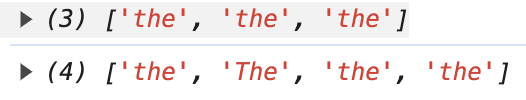
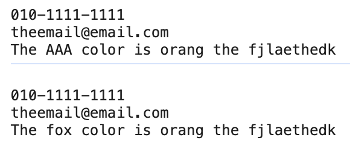
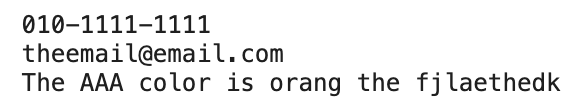

# 정규 표현식(Regexp)

정규식, Regular Expression

https://heropy.blog/2018/10/28/regexp/

## 역할

- 문자 검색 (search)
  - 패턴과 일치하는 문자를 검색
- 문자 대체 (replace)
  - 검색한 문자를 다른 문자로 대체
- 문자 추출 (extract)
  - 검색한 문자를 추출

## 테스트 사이트

https://regexr.com/

## 정규식 생성

```js
//생성자 방식
new RegExp('표현','옵션')
new RegExp('[a-z]','gi')

//리터럴 방식
/표현/옵션
/[a-z]/gi
```

## 정규식 플래그 (옵션)

플래그 | 의미 | 설명
--|--|--
g | global | 동일 문자 전체 찾기  
i | ignore case | 대소문자 구분 안함
m | multi line | 여러 줄 일치

특수문자를 특수문자가 아닌 일반문자로 사용하고 싶을 경우 앞에 \를 넣어야 한다.  
하나의 문자 데이터는 문재데이터 전체를 기준으로 시작과 끝이 정해진다(줄바꿈의 의미가 없다.)  
그럴때 m을 사용하여 문자 데이터를 여러 줄로 인식 하게 만들면 된다.

```js
const str = `
010-1111-1111
theemail@email.com
The fox color is orang the fjlaethedk
` //따옴표는 줄바꿈 불가/백틱 사용하면 가능

// const regexp = new RegExp('the', 'g')
// const all = new RegExp('the', 'gi')

const doppel = /the/g//g플래그 = 동일 문자 찾기
const all = /the/gi  //i플래그 = 대소문자 구별 안함

console.log(str.match(doppel))
console.log(str.match(all))
```


## 정규식 메소드

메소드 | 문법 | 설명
--|--|--
test | `정규식.test(문자열 인수)` | 일치 여부(Boolean)반환
match | `문자열.match(정규식)` | 일치하는 문자열의 배열 데이터를 반환
replace | `문자열.replace(정규식,대체문자)` | 일치하는 문자열을 대체하고 대체된 문자열(string)을 반환

```js
const str = `
010-1111-1111
theemail@email.com
The fox color is orang the fjlaethedk
` //따옴표는 줄바꿈 불가/백틱 사용하면 가능

const regexp = /fox/gi
console.log(regexp.test(str)) //정규식 regexp
//true
```

```js
const str = `
010-1111-1111
theemail@email.com
The fox color is orang the fjlaethedk
` //따옴표는 줄바꿈 불가/백틱 사용하면 가능

const regexp = /fox/gi
console.log(str.replace(regexp, 'AAA'))
console.log(str) // fox가 AAA로 변경되지 않은 상태로 출력된다.
//str을 const가 아닌 재할당이 가능한 let으로 변경해서 작성하면 변경 가능하다
```

```js
let str = `
010-1111-1111
theemail@email.com
The fox color is orang the fjlaethedk
` //따옴표는 줄바꿈 불가/백틱 사용하면 가능

const regexp = /fox/gi
str = str.replace(regexp, 'AAA')
console.log(str)
```


## 정규식 패턴(표현)

패턴 | 설명
--|--
^ab | 줄(line) 시작에 있는 ab와 일치
ab$ | 줄(line) 끝에 있는 ab와 일치

```js
const str = `
010-1111-1111
theemail@email.com
The fox color is orang the fjlaethedk
` //따옴표는 줄바꿈 불가/백틱 사용하면 가능

console.log(
  str.match(/k$/gm) //플래그 m을 사용하여 여러줄 찾기를 한다.
) // 하나의 k가 찾아진다
console.log(
  str.match(/^t/gim)
) // t와 T가 하나씩 찾아진다
```

패턴 | 설명
--|--
. | 임의의 한 문자와 일치 (공백, 일부 특수문자 포함)
a\|b | a 또는 b와 일치
ab? | b가 없거나 b와 일치

a|b를 표에서 정리하기 위해 $verbar; 를 | 자리에 넣거나 | 앞에 \를 넣는다

```js
const str = `
010-1111-1111
theemail@email.com
"https://www.qwertwerqwrqer"
"http://www.erafadfefwafa"
The fox color is orang the fjlaethedk
` //따옴표는 줄바꿈 불가/백틱 사용하면 가능

console.log(
  str.match(/c...r/g) //.은 임의의 한 글자에 일치한다.
)//['color'] 반환
console.log(
  str.match(/fox|orang/g)
)//['fox', 'orang'] 반환
console.log(
  str.match(/fox|orang/)
)//fox만 반환
console.log(
  str.match(/https?/g)
)//['https', 'http'] 반환
```

패턴 | 설명
--|--
{n} | n개 연속 일치
{n, } | n개 이상 연속 일치
{n,m} | n개 이상 m개 이하 연속 일치

```js
const str = `
010-1111-1111
theemail@email.com
"https://www.qwertwerqwrqer"
"http://www.erafadfefwafa"
The fox color is orang the fjlaethedk
` //따옴표는 줄바꿈 불가/백틱 사용하면 가능

console.log(
  str.match(/1{2,3}/g)
)//['111', '111']
```
```js
console.log(
  str.match(/\w{2,3}/g)//숫자를 포함한 영어 알파벳이 2~3인 내용을 모두 찾는다
)//['010', '111', '111', 'the', 'ema', 'il', 'ema', 'il', 'com', 'htt', 'ps', 'www', 'qwe', 'rtw', 'erq', 'wrq', 'er', 'htt', 'www', 'era'...
```
```js
console.log(
  str.match(/\b\w{2,3}\b/g)//숫자나 영문자가 아닌 것을 경계로 만든다.
)//['010', 'com', 'www', 'www', 'The', 'fox', 'is', 'the']
```

패턴 | 설명
--|--
[abc] | a 또는 b 또는 c를 찾는다
[a-z] | a부터 z 사이의 문자 구간에 일치
[A-Z] | A부터 Z 사이의 문자 구간에 일치
[0-9] | 0부터 9 사이의 문자 구간에 일치
[가-힣] | 가부터 힣 사이의 문자 구간에 일치

```js
console.log(
  str.match(/[fox]/g)
)//['o', 'f', 'f', 'f', 'f', 'f', 'o', 'x', 'o', 'o', 'o', 'f']
```
```js
console.log(
  str.match(/[0-9]{1,}/g)
)//['010', '1111', '1111']
```

패턴 | 설명
--|--
\w | 63개의 문자(대소문자52개, 숫자10개, _)에 일치
\b | w에 일치하지 않는 나머지 문자 경계
\d | 숫자에 일치
\s | 공백 문자(Space, Tab 등)에 일치

```js
console.log(
  str.match(/\bf\w{1,}\b/g)
)//['fox', 'fjlaethedk']
```
```js
console.log(
  str.match(/\d{1,}/g)
)//['010', '1111', '1111']
```
```js
console.log(
  str.match(/\s/g)
)//['\n', '\n', '\n', '\n', '\n', ' ', ' ', ' ', ' ', ' ', ' ', '\n']
```
```js
const h = `  the hello  world  !
`
console.log(
  h.replace(/\s/g, '')
)//thehelloworld!
```

패턴 | 설명
--|--
(?=) | 앞쪽 일치
(?<=) | 뒤쪽 일치
```js
console.log(
  str.match(/.{1,}(?=\@)/g)
  //@ 기호는 정규식에서 아무런 의미를 가지지 않는다. 따라서 \를 사용하지 않아도 된다.
)//['theemail']
console.log(
  str.match(/(?<=@).{1,}/g)
)//['email.com']
```